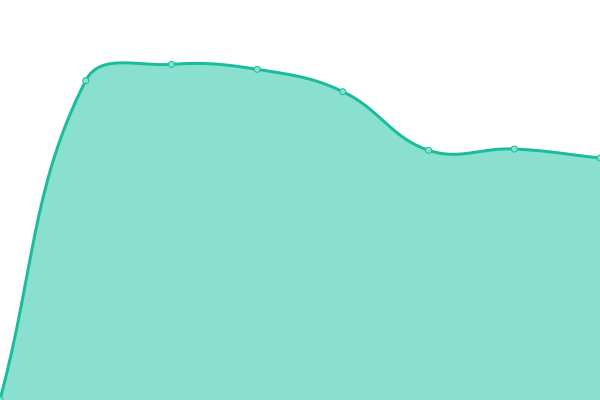

# [📈 Canlı Durum](https://status.betterwith.agency): <!--live status--> **🟧 Partial outage**

This repository contains the open-source uptime monitor and status page for [betterwithagency](https://status.betterwith.agency), powered by [Upptime](https://github.com/upptime/upptime).

With [Upptime](https://upptime.js.org), you can get your own unlimited and free uptime monitor and status page, powered entirely by a GitHub repository. We use [Issues](https://github.com/betterwithagency/status-page/issues) as incident reports, [Actions](https://github.com/betterwithagency/status-page/actions) as uptime monitors, and [Pages](https://status.betterwith.agency) for the status page.

## [📈 Live Status](https://demo.upptime.js.org): <!--live status--> **🟧 Partial outage**

<!--start: status pages-->
<!-- This summary is generated by Upptime (https://github.com/upptime/upptime) -->
<!-- Do not edit this manually, your changes will be overwritten -->
<!-- prettier-ignore -->
| URL | Status | History | Response Time | Uptime |
| --- | ------ | ------- | ------------- | ------ |
|  [bw/a](https://bw.agency) | Yayında | [bw-a.yml](https://github.com/betterwithagency/status-page/commits/HEAD/history/bw-a.yml) | 

 1465ms
     
 | 

<a href="https://status.betterwith.agency/history/bw-a">100.00%</a>
    

|  [Yula](https://yulala.co) | Yayında | [yula.yml](https://github.com/betterwithagency/status-page/commits/HEAD/history/yula.yml) | 

 9864ms
     
 | 

<a href="https://status.betterwith.agency/history/yula">100.00%</a>
    

|  [bw/a Support](https://support.bw.agency) | Yayında | [bw-a-support.yml](https://github.com/betterwithagency/status-page/commits/HEAD/history/bw-a-support.yml) | 

 1686ms
     
 | 

<a href="https://status.betterwith.agency/history/bw-a-support">100.00%</a>
    

|  [bw/a Smart](https://smart.betterwith.agency) | Yayında | [bw-a-smart.yml](https://github.com/betterwithagency/status-page/commits/HEAD/history/bw-a-smart.yml) | 

 1165ms
     
 | 

<a href="https://status.betterwith.agency/history/bw-a-smart">100.00%</a>
    

|  [Emir Tarlan](https://emirtarlan.com) | Yayında | [emir-tarlan.yml](https://github.com/betterwithagency/status-page/commits/HEAD/history/emir-tarlan.yml) | 

 2661ms
     
 | 

<a href="https://status.betterwith.agency/history/emir-tarlan">97.77%</a>
    

|  [Esra BULUT](https://esrabulut.com.tr) | Yayında | [esra-bulut.yml](https://github.com/betterwithagency/status-page/commits/HEAD/history/esra-bulut.yml) | 

 1780ms
     
 | 

<a href="https://status.betterwith.agency/history/esra-bulut">97.80%</a>
    

|  [Uzman Randevu](https://uzmanrandevu.com.tr) | Yayında | [uzman-randevu.yml](https://github.com/betterwithagency/status-page/commits/HEAD/history/uzman-randevu.yml) | 

 1041ms
     
 | 

<a href="https://status.betterwith.agency/history/uzman-randevu">98.58%</a>
    

|  [Flamingo Psikoloji](https://flamingopsikoloji.com) | Yayında | [flamingo-psikoloji.yml](https://github.com/betterwithagency/status-page/commits/HEAD/history/flamingo-psikoloji.yml) | 

 977ms
     
 | 

<a href="https://status.betterwith.agency/history/flamingo-psikoloji">100.00%</a>
    

|  [Mon Yoga](https://monyoga.co) | Yayında | [mon-yoga.yml](https://github.com/betterwithagency/status-page/commits/HEAD/history/mon-yoga.yml) | 

 1869ms
     
 | 

<a href="https://status.betterwith.agency/history/mon-yoga">97.47%</a>
    

|  [Samsun Esnaf ve Sanatkarlar Kredi ve Kefalet Kooperatifi](https://samsunekk.com) | Yayında | [samsun-esnaf-ve-sanatkarlar-kredi-ve-kefalet-kooperatifi.yml](https://github.com/betterwithagency/status-page/commits/HEAD/history/samsun-esnaf-ve-sanatkarlar-kredi-ve-kefalet-kooperatifi.yml) | 

 777ms
     
 | 

<a href="https://status.betterwith.agency/history/samsun-esnaf-ve-sanatkarlar-kredi-ve-kefalet-kooperatifi">100.00%</a>
    

|  [SAK Vinç](https://sakvinc.com.tr) | Yayında Değil | [sak-vinc.yml](https://github.com/betterwithagency/status-page/commits/HEAD/history/sak-vinc.yml) | 

 0ms
     
 | 

<a href="https://status.betterwith.agency/history/sak-vinc">0.00%</a>
    

|  [Evren Mühendislik](https://evrenmuh.com.tr) | Yayında | [evren-muehendislik.yml](https://github.com/betterwithagency/status-page/commits/HEAD/history/evren-muehendislik.yml) | 

 1015ms
     
 | 

<a href="https://status.betterwith.agency/history/evren-muehendislik">100.00%</a>
    

|  [Tamer Şahinoğlu](https://tamersahinoglu.com) | Yayında | [tamer-sahinoglu.yml](https://github.com/betterwithagency/status-page/commits/HEAD/history/tamer-sahinoglu.yml) | 

 804ms
     
 | 

<a href="https://status.betterwith.agency/history/tamer-sahinoglu">100.00%</a>
    

|  [Kirke Agency](https://kirke.agency) | Yayında | [kirke-agency.yml](https://github.com/betterwithagency/status-page/commits/HEAD/history/kirke-agency.yml) | 

 956ms
     
 | 

<a href="https://status.betterwith.agency/history/kirke-agency">97.60%</a>
    

|  [Reges Hotel](https://reges.com.tr) | Yayında | [reges-hotel.yml](https://github.com/betterwithagency/status-page/commits/HEAD/history/reges-hotel.yml) | 

 1094ms
     
 | 

<a href="https://status.betterwith.agency/history/reges-hotel">97.52%</a>
    

|  [Reges Hotel Offers Portal](https://offer.reges.com.tr) | Yayında | [reges-hotel-offers-portal.yml](https://github.com/betterwithagency/status-page/commits/HEAD/history/reges-hotel-offers-portal.yml) | 

 1363ms
     
 | 

<a href="https://status.betterwith.agency/history/reges-hotel-offers-portal">98.35%</a>
    

|  [Velime Davetiye](https://velime.com) | Yayında | [velime-davetiye.yml](https://github.com/betterwithagency/status-page/commits/HEAD/history/velime-davetiye.yml) | 

 771ms
     
 | 

<a href="https://status.betterwith.agency/history/velime-davetiye">100.00%</a>
    

|  [Samsun Çocuk Gelişimi](https://samsuncocukgelisimi.com) | Yayında | [samsun-cocuk-gelisimi.yml](https://github.com/betterwithagency/status-page/commits/HEAD/history/samsun-cocuk-gelisimi.yml) | 

 1877ms
     
 | 

<a href="https://status.betterwith.agency/history/samsun-cocuk-gelisimi">97.88%</a>
    

|  [Samsun Psikoterapi Merkezi](https://samsunpsikoterapi.tr) | Yayında | [samsun-psikoterapi-merkezi.yml](https://github.com/betterwithagency/status-page/commits/HEAD/history/samsun-psikoterapi-merkezi.yml) | 

 4558ms
     
 | 

<a href="https://status.betterwith.agency/history/samsun-psikoterapi-merkezi">98.15%</a>
    

|  [Shine at Date](https://shineatdate.com) | Yayında Değil | [shine-at-date.yml](https://github.com/betterwithagency/status-page/commits/HEAD/history/shine-at-date.yml) | 

 0ms
     
 | 

<a href="https://status.betterwith.agency/history/shine-at-date">0.00%</a>
    

|  [Samsun Gençlik Platformu](https://samsungenclikplatformu.org.tr) | Yayında | [samsun-genclik-platformu.yml](https://github.com/betterwithagency/status-page/commits/HEAD/history/samsun-genclik-platformu.yml) | 

 2339ms
     
 | 

<a href="https://status.betterwith.agency/history/samsun-genclik-platformu">97.93%</a>
    

|  [Online Diyetisyenim](https://onlinediyetisyenim.tr) | Yayında | [online-diyetisyenim.yml](https://github.com/betterwithagency/status-page/commits/HEAD/history/online-diyetisyenim.yml) | 

 2132ms
     
 | 

<a href="https://status.betterwith.agency/history/online-diyetisyenim">98.79%</a>
    

|  [You Psikoloji](https://youpsikoloji.com) | Yayında | [you-psikoloji.yml](https://github.com/betterwithagency/status-page/commits/HEAD/history/you-psikoloji.yml) | 

 3944ms
     
 | 

<a href="https://status.betterwith.agency/history/you-psikoloji">98.01%</a>
    

|  [Zirve Psikoloji](https://zirvepsikoloji.com) | Yayında | [zirve-psikoloji.yml](https://github.com/betterwithagency/status-page/commits/HEAD/history/zirve-psikoloji.yml) | 

 2081ms
     
 | 

<a href="https://status.betterwith.agency/history/zirve-psikoloji">98.17%</a>
    

|  [Kırkangıç Concept](https://kirlangicconcept.com) | Yayında | [kirkangic-concept.yml](https://github.com/betterwithagency/status-page/commits/HEAD/history/kirkangic-concept.yml) | 

 3308ms
     
 | 

<a href="https://status.betterwith.agency/history/kirkangic-concept">98.17%</a>
    

|  [Betül Aksoy Psikoloji](https://betulaksoypsikoloji.com) | Yayında | [betuel-aksoy-psikoloji.yml](https://github.com/betterwithagency/status-page/commits/HEAD/history/betuel-aksoy-psikoloji.yml) | 

 2813ms
     
 | 

<a href="https://status.betterwith.agency/history/betuel-aksoy-psikoloji">97.99%</a>
    

|  [Vize Samsun](https://vizesamsun.com) | Yayında | [vize-samsun.yml](https://github.com/betterwithagency/status-page/commits/HEAD/history/vize-samsun.yml) | 

 762ms
     
 | 

<a href="https://status.betterwith.agency/history/vize-samsun">100.00%</a>
    

|  [Doris Marine](https://dorismarine.com) | Yayında | [doris-marine.yml](https://github.com/betterwithagency/status-page/commits/HEAD/history/doris-marine.yml) | 

 2816ms
     
 | 

<a href="https://status.betterwith.agency/history/doris-marine">100.00%</a>
    

|  [SamsunPsikolog.net](https://samsunpsikolog.net) | Yayında Değil | [samsun-psikolog-net.yml](https://github.com/betterwithagency/status-page/commits/HEAD/history/samsun-psikolog-net.yml) | 

 2990ms
     
 | 

<a href="https://status.betterwith.agency/history/samsun-psikolog-net">56.41%</a>
    

|  [No7 Training Studio](https://no7training.studio) | Yayında | [no7-training-studio.yml](https://github.com/betterwithagency/status-page/commits/HEAD/history/no7-training-studio.yml) | 

 2928ms
     
 | 

<a href="https://status.betterwith.agency/history/no7-training-studio">98.00%</a>
    

|  [Wiyanawanda Fest Bodrum](https://wiyanawandafest.com) | Yayında | [wiyanawanda-fest-bodrum.yml](https://github.com/betterwithagency/status-page/commits/HEAD/history/wiyanawanda-fest-bodrum.yml) | 

 946ms
     
 | 

<a href="https://status.betterwith.agency/history/wiyanawanda-fest-bodrum">100.00%</a>
    

|  [Akıncı Yapı Yönetim](https://akinciyonetim.com) | Yayında | [akinci-yapi-yoenetim.yml](https://github.com/betterwithagency/status-page/commits/HEAD/history/akinci-yapi-yoenetim.yml) | 

 2653ms
     
 | 

<a href="https://status.betterwith.agency/history/akinci-yapi-yoenetim">98.08%</a>
    

|  [Antalya Terapistim Ads](https://ads.antalyaterapistim.com) | Yayında | [antalya-terapistim-ads.yml](https://github.com/betterwithagency/status-page/commits/HEAD/history/antalya-terapistim-ads.yml) | 

 1777ms
     
 | 

<a href="https://status.betterwith.agency/history/antalya-terapistim-ads">98.03%</a>
    

<!--end: status pages-->

[**Visit our status website →**](https://status.betterwith.agency)

## 📄 License

- Powered by: [Upptime](https://github.com/upptime/upptime)
- Code: [MIT](./LICENSE) © [Anand Chowdhary](https://anandchowdhary.com), supported by [Pabio](https://pabio.com)
- Data in the `./history` directory: [Open Database License](https://opendatacommons.org/licenses/odbl/1-0/)
