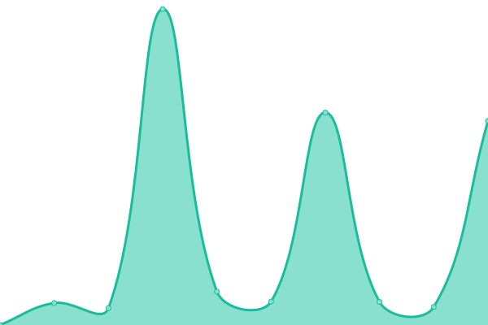

# [📈 Canlı Durum](https://status.betterwith.agency): <!--live status--> **🟧 Partial outage**

This repository contains the open-source uptime monitor and status page for [betterwithagency](https://status.betterwith.agency), powered by [Upptime](https://github.com/upptime/upptime).

With [Upptime](https://upptime.js.org), you can get your own unlimited and free uptime monitor and status page, powered entirely by a GitHub repository. We use [Issues](https://github.com/betterwithagency/status-page/issues) as incident reports, [Actions](https://github.com/betterwithagency/status-page/actions) as uptime monitors, and [Pages](https://status.betterwith.agency) for the status page.

## [📈 Live Status](https://demo.upptime.js.org): <!--live status--> **🟧 Partial outage**

<!--start: status pages-->
<!-- This summary is generated by Upptime (https://github.com/upptime/upptime) -->
<!-- Do not edit this manually, your changes will be overwritten -->
<!-- prettier-ignore -->
| URL | Status | History | Response Time | Uptime |
| --- | ------ | ------- | ------------- | ------ |
|  [bw/a](https://bw.agency) | Yayında | [bw-a.yml](https://github.com/betterwithagency/status-page/commits/HEAD/history/bw-a.yml) | 

 1771ms
     
 | 

<a href="https://status.betterwith.agency/history/bw-a">100.00%</a>
    

|  [Yula](https://yulala.co) | Yayında | [yula.yml](https://github.com/betterwithagency/status-page/commits/HEAD/history/yula.yml) | 

 984ms
     
 | 

<a href="https://status.betterwith.agency/history/yula">100.00%</a>
    

|  [bw/a Support](https://support.bw.agency) | Yayında | [bw-a-support.yml](https://github.com/betterwithagency/status-page/commits/HEAD/history/bw-a-support.yml) | 

 2079ms
     
 | 

<a href="https://status.betterwith.agency/history/bw-a-support">100.00%</a>
    

|  [bw/a Smart](https://smart.betterwith.agency) | Yayında | [bw-a-smart.yml](https://github.com/betterwithagency/status-page/commits/HEAD/history/bw-a-smart.yml) | 

 1525ms
     
 | 

<a href="https://status.betterwith.agency/history/bw-a-smart">100.00%</a>
    

|  [Aysu Elbi](https://seans.aysuelbi.com) | Yayında | [aysu-elbi.yml](https://github.com/betterwithagency/status-page/commits/HEAD/history/aysu-elbi.yml) | 

 1924ms
     
 | 

<a href="https://status.betterwith.agency/history/aysu-elbi">100.00%</a>
    

|  [Emir Tarlan](https://emirtarlan.com) | Yayında | [emir-tarlan.yml](https://github.com/betterwithagency/status-page/commits/HEAD/history/emir-tarlan.yml) | 

 1692ms
     
 | 

<a href="https://status.betterwith.agency/history/emir-tarlan">0.37%</a>
    

|  [Esra BULUT](https://esrabulut.com.tr) | Yayında | [esra-bulut.yml](https://github.com/betterwithagency/status-page/commits/HEAD/history/esra-bulut.yml) | 

 1460ms
     
 | 

<a href="https://status.betterwith.agency/history/esra-bulut">100.00%</a>
    

|  [Flamingo Psikoloji](https://flamingopsikoloji.com) | Yayında | [flamingo-psikoloji.yml](https://github.com/betterwithagency/status-page/commits/HEAD/history/flamingo-psikoloji.yml) | 

 1768ms
     
 | 

<a href="https://status.betterwith.agency/history/flamingo-psikoloji">100.00%</a>
    

|  [Mon Yoga](https://monyoga.co) | Yayında | [mon-yoga.yml](https://github.com/betterwithagency/status-page/commits/HEAD/history/mon-yoga.yml) | 

 1128ms
     
 | 

<a href="https://status.betterwith.agency/history/mon-yoga">100.00%</a>
    

|  [Samsun Esnaf ve Sanatkarlar Kredi ve Kefalet Kooperatifi](https://samsunekk.com) | Yayında | [samsun-esnaf-ve-sanatkarlar-kredi-ve-kefalet-kooperatifi.yml](https://github.com/betterwithagency/status-page/commits/HEAD/history/samsun-esnaf-ve-sanatkarlar-kredi-ve-kefalet-kooperatifi.yml) | 

 1377ms
     
 | 

<a href="https://status.betterwith.agency/history/samsun-esnaf-ve-sanatkarlar-kredi-ve-kefalet-kooperatifi">100.00%</a>
    

|  [SAK Vinç](https://sakvinc.com.tr) | Yayında Değil | [sak-vinc.yml](https://github.com/betterwithagency/status-page/commits/HEAD/history/sak-vinc.yml) | 

 0ms
     
 | 

<a href="https://status.betterwith.agency/history/sak-vinc">0.00%</a>
    

|  [Evren Mühendislik](https://evrenmuh.com.tr) | Yayında | [evren-muehendislik.yml](https://github.com/betterwithagency/status-page/commits/HEAD/history/evren-muehendislik.yml) | 

 1634ms
     
 | 

<a href="https://status.betterwith.agency/history/evren-muehendislik">100.00%</a>
    

|  [Tamer Şahinoğlu](https://tamersahinoglu.com) | Yayında | [tamer-sahinoglu.yml](https://github.com/betterwithagency/status-page/commits/HEAD/history/tamer-sahinoglu.yml) | 

 1827ms
     
 | 

<a href="https://status.betterwith.agency/history/tamer-sahinoglu">100.00%</a>
    

|  [Shine at Date](https://shineatdate.com) | Yayında | [shine-at-date.yml](https://github.com/betterwithagency/status-page/commits/HEAD/history/shine-at-date.yml) | 

 1542ms
     
 | 

<a href="https://status.betterwith.agency/history/shine-at-date">100.00%</a>
    

|  [Samsun Gençlik Platformu](https://samsungenclikplatformu.org.tr) | Yayında | [samsun-genclik-platformu.yml](https://github.com/betterwithagency/status-page/commits/HEAD/history/samsun-genclik-platformu.yml) | 

 1409ms
     
 | 

<a href="https://status.betterwith.agency/history/samsun-genclik-platformu">100.00%</a>
    

|  [Zirve Psikoloji](https://zirvepsikoloji.com) | Yayında | [zirve-psikoloji.yml](https://github.com/betterwithagency/status-page/commits/HEAD/history/zirve-psikoloji.yml) | 

 1333ms
     
 | 

<a href="https://status.betterwith.agency/history/zirve-psikoloji">100.00%</a>
    

|  [Wiyanawanda Fest Bodrum](https://wiyanawandafest.com) | Yayında | [wiyanawanda-fest-bodrum.yml](https://github.com/betterwithagency/status-page/commits/HEAD/history/wiyanawanda-fest-bodrum.yml) | 

 1098ms
     
 | 

<a href="https://status.betterwith.agency/history/wiyanawanda-fest-bodrum">100.00%</a>
    

<!--end: status pages-->

[**Visit our status website →**](https://status.betterwith.agency)

## 📄 License

- Powered by: [Upptime](https://github.com/upptime/upptime)
- Code: [MIT](./LICENSE) © [Anand Chowdhary](https://anandchowdhary.com), supported by [Pabio](https://pabio.com)
- Data in the `./history` directory: [Open Database License](https://opendatacommons.org/licenses/odbl/1-0/)
