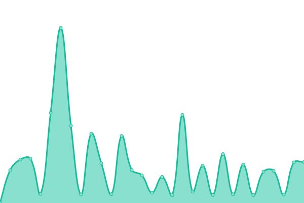

# [📈 Canlı Durum](https://status.betterwith.agency): <!--live status--> **🟧 Partial outage**

This repository contains the open-source uptime monitor and status page for [betterwithagency](https://status.betterwith.agency), powered by [Upptime](https://github.com/upptime/upptime).

With [Upptime](https://upptime.js.org), you can get your own unlimited and free uptime monitor and status page, powered entirely by a GitHub repository. We use [Issues](https://github.com/betterwithagency/status-page/issues) as incident reports, [Actions](https://github.com/betterwithagency/status-page/actions) as uptime monitors, and [Pages](https://status.betterwith.agency) for the status page.

## [📈 Live Status](https://demo.upptime.js.org): <!--live status--> **🟧 Partial outage**

<!--start: status pages-->
<!-- This summary is generated by Upptime (https://github.com/upptime/upptime) -->
<!-- Do not edit this manually, your changes will be overwritten -->
<!-- prettier-ignore -->
| URL | Status | History | Response Time | Uptime |
| --- | ------ | ------- | ------------- | ------ |
|  [bw/a](https://bw.agency) | Yayında | [bw-a.yml](https://github.com/betterwithagency/status-page/commits/HEAD/history/bw-a.yml) | 

 3576ms
     
 | 

<a href="https://status.betterwith.agency/history/bw-a">98.69%</a>
    

|  [Yula](https://yulala.co) | Yayında | [yula.yml](https://github.com/betterwithagency/status-page/commits/HEAD/history/yula.yml) | 

 8289ms
     
 | 

<a href="https://status.betterwith.agency/history/yula">97.56%</a>
    

|  [bw/a Support](https://support.bw.agency) | Yayında | [bw-a-support.yml](https://github.com/betterwithagency/status-page/commits/HEAD/history/bw-a-support.yml) | 

 6079ms
     
 | 

<a href="https://status.betterwith.agency/history/bw-a-support">97.96%</a>
    

|  [bw/a Smart](https://smart.betterwith.agency) | Yayında | [bw-a-smart.yml](https://github.com/betterwithagency/status-page/commits/HEAD/history/bw-a-smart.yml) | 

 1864ms
     
 | 

<a href="https://status.betterwith.agency/history/bw-a-smart">97.98%</a>
    

|  [Emir Tarlan](https://emirtarlan.com) | Yayında | [emir-tarlan.yml](https://github.com/betterwithagency/status-page/commits/HEAD/history/emir-tarlan.yml) | 

 1363ms
     
 | 

<a href="https://status.betterwith.agency/history/emir-tarlan">98.47%</a>
    

|  [Esra BULUT](https://esrabulut.com.tr) | Yayında | [esra-bulut.yml](https://github.com/betterwithagency/status-page/commits/HEAD/history/esra-bulut.yml) | 

 921ms
     
 | 

<a href="https://status.betterwith.agency/history/esra-bulut">100.00%</a>
    

|  [Uzman Randevu](https://uzmanrandevu.com.tr) | Yayında Değil | [uzman-randevu.yml](https://github.com/betterwithagency/status-page/commits/HEAD/history/uzman-randevu.yml) | 

 0ms
     
 | 

<a href="https://status.betterwith.agency/history/uzman-randevu">0.00%</a>
    

|  [Flamingo Psikoloji](https://flamingopsikoloji.com) | Yayında | [flamingo-psikoloji.yml](https://github.com/betterwithagency/status-page/commits/HEAD/history/flamingo-psikoloji.yml) | 

 6978ms
     
 | 

<a href="https://status.betterwith.agency/history/flamingo-psikoloji">97.10%</a>
    

|  [Samsun Esnaf ve Sanatkarlar Kredi ve Kefalet Kooperatifi](https://samsunekk.com) | Yayında | [samsun-esnaf-ve-sanatkarlar-kredi-ve-kefalet-kooperatifi.yml](https://github.com/betterwithagency/status-page/commits/HEAD/history/samsun-esnaf-ve-sanatkarlar-kredi-ve-kefalet-kooperatifi.yml) | 

 4523ms
     
 | 

<a href="https://status.betterwith.agency/history/samsun-esnaf-ve-sanatkarlar-kredi-ve-kefalet-kooperatifi">100.00%</a>
    

|  [SAK Vinç](https://sakvinc.com.tr) | Yayında | [sak-vinc.yml](https://github.com/betterwithagency/status-page/commits/HEAD/history/sak-vinc.yml) | 

 811ms
     
 | 

<a href="https://status.betterwith.agency/history/sak-vinc">100.00%</a>
    

|  [Evren Mühendislik](https://evrenmuh.com.tr) | Yayında | [evren-muehendislik.yml](https://github.com/betterwithagency/status-page/commits/HEAD/history/evren-muehendislik.yml) | 

 5874ms
     
 | 

<a href="https://status.betterwith.agency/history/evren-muehendislik">97.93%</a>
    

|  [Tamer Şahinoğlu](https://tamersahinoglu.com) | Yayında Değil | [tamer-sahinoglu.yml](https://github.com/betterwithagency/status-page/commits/HEAD/history/tamer-sahinoglu.yml) | 

 2494ms
     
 | 

<a href="https://status.betterwith.agency/history/tamer-sahinoglu">0.00%</a>
    

|  [Kirke Agency](https://kirke.agency) | Yayında | [kirke-agency.yml](https://github.com/betterwithagency/status-page/commits/HEAD/history/kirke-agency.yml) | 

 855ms
     
 | 

<a href="https://status.betterwith.agency/history/kirke-agency">99.55%</a>
    

|  [Reges Hotel](https://reges.com.tr) | Yayında | [reges-hotel.yml](https://github.com/betterwithagency/status-page/commits/HEAD/history/reges-hotel.yml) | 

 798ms
     
 | 

<a href="https://status.betterwith.agency/history/reges-hotel">100.00%</a>
    

|  [Reges Hotel Offers Portal](https://offer.reges.com.tr) | Yayında Değil | [reges-hotel-offers-portal.yml](https://github.com/betterwithagency/status-page/commits/HEAD/history/reges-hotel-offers-portal.yml) | 

 0ms
     
 | 

<a href="https://status.betterwith.agency/history/reges-hotel-offers-portal">0.00%</a>
    

|  [DavetiyeGross](https://davetiyegross.com) | Yayında | [davetiye-gross.yml](https://github.com/betterwithagency/status-page/commits/HEAD/history/davetiye-gross.yml) | 

 5076ms
     
 | 

<a href="https://status.betterwith.agency/history/davetiye-gross">99.17%</a>
    

|  [Velime Davetiye](https://velime.com) | Yayında | [velime-davetiye.yml](https://github.com/betterwithagency/status-page/commits/HEAD/history/velime-davetiye.yml) | 

 4437ms
     
 | 

<a href="https://status.betterwith.agency/history/velime-davetiye">100.00%</a>
    

|  [Toptan Davetiyeler](https://toptandavetiyeler.com.tr) | Yayında | [toptan-davetiyeler.yml](https://github.com/betterwithagency/status-page/commits/HEAD/history/toptan-davetiyeler.yml) | 

 195ms
     
 | 

<a href="https://status.betterwith.agency/history/toptan-davetiyeler">100.00%</a>
    

|  [Düğün Davetiye](https://dugundavetiye.tr) | Yayında | [dueguen-davetiye.yml](https://github.com/betterwithagency/status-page/commits/HEAD/history/dueguen-davetiye.yml) | 

 186ms
     
 | 

<a href="https://status.betterwith.agency/history/dueguen-davetiye">100.00%</a>
    

|  [Davetiye Modelleri](https://davetiyemodelleri.tr) | Yayında | [davetiye-modelleri.yml](https://github.com/betterwithagency/status-page/commits/HEAD/history/davetiye-modelleri.yml) | 

 160ms
     
 | 

<a href="https://status.betterwith.agency/history/davetiye-modelleri">100.00%</a>
    

|  [Samsun Çocuk Gelişimi](https://samsuncocukgelisimi.com) | Yayında | [samsun-cocuk-gelisimi.yml](https://github.com/betterwithagency/status-page/commits/HEAD/history/samsun-cocuk-gelisimi.yml) | 

 979ms
     
 | 

<a href="https://status.betterwith.agency/history/samsun-cocuk-gelisimi">100.00%</a>
    

|  [Ohana Psikoloji](https://ohanapsikoloji.com) | Yayında | [ohana-psikoloji.yml](https://github.com/betterwithagency/status-page/commits/HEAD/history/ohana-psikoloji.yml) | 

 1074ms
     
 | 

<a href="https://status.betterwith.agency/history/ohana-psikoloji">100.00%</a>
    

|  [Samsun Psikoterapi Merkezi](https://samsunpsikoterapi.tr) | Yayında | [samsun-psikoterapi-merkezi.yml](https://github.com/betterwithagency/status-page/commits/HEAD/history/samsun-psikoterapi-merkezi.yml) | 

 1105ms
     
 | 

<a href="https://status.betterwith.agency/history/samsun-psikoterapi-merkezi">100.00%</a>
    

|  [Shine at Date](https://shineatdate.com) | Yayında | [shine-at-date.yml](https://github.com/betterwithagency/status-page/commits/HEAD/history/shine-at-date.yml) | 

 7511ms
     
 | 

<a href="https://status.betterwith.agency/history/shine-at-date">98.77%</a>
    

|  [You Psikoloji](https://youpsikoloji.com) | Yayında Değil | [you-psikoloji.yml](https://github.com/betterwithagency/status-page/commits/HEAD/history/you-psikoloji.yml) | 

 815ms
     
 | 

<a href="https://status.betterwith.agency/history/you-psikoloji">61.69%</a>
    

|  [Zirve Psikoloji](https://zirvepsikoloji.com) | Yayında | [zirve-psikoloji.yml](https://github.com/betterwithagency/status-page/commits/HEAD/history/zirve-psikoloji.yml) | 

 1016ms
     
 | 

<a href="https://status.betterwith.agency/history/zirve-psikoloji">99.79%</a>
    

|  [Kırkangıç Concept](https://kirlangicconcept.com) | Yayında Değil | [kirkangic-concept.yml](https://github.com/betterwithagency/status-page/commits/HEAD/history/kirkangic-concept.yml) | 

 0ms
     
 | 

<a href="https://status.betterwith.agency/history/kirkangic-concept">0.00%</a>
    

|  [Vize Samsun](https://vizesamsun.com) | Yayında | [vize-samsun.yml](https://github.com/betterwithagency/status-page/commits/HEAD/history/vize-samsun.yml) | 

 836ms
     
 | 

<a href="https://status.betterwith.agency/history/vize-samsun">100.00%</a>
    

|  [Doris Marine](https://dorisshipyard.com) | Yayında | [doris-marine.yml](https://github.com/betterwithagency/status-page/commits/HEAD/history/doris-marine.yml) | 

 802ms
     
 | 

<a href="https://status.betterwith.agency/history/doris-marine">100.00%</a>
    

|  [SamsunPsikolog.net](https://samsunpsikolog.net) | Yayında | [samsun-psikolog-net.yml](https://github.com/betterwithagency/status-page/commits/HEAD/history/samsun-psikolog-net.yml) | 

 1128ms
     
 | 

<a href="https://status.betterwith.agency/history/samsun-psikolog-net">99.82%</a>
    

|  [SamsunPsikolog.org](https://samsunpsikolog.org) | Yayında | [samsun-psikolog-org.yml](https://github.com/betterwithagency/status-page/commits/HEAD/history/samsun-psikolog-org.yml) | 

 858ms
     
 | 

<a href="https://status.betterwith.agency/history/samsun-psikolog-org">100.00%</a>
    

|  [SamsunPsikolog.org.tr](https://samsunpsikolog.org.tr) | Yayında | [samsun-psikolog-org-tr.yml](https://github.com/betterwithagency/status-page/commits/HEAD/history/samsun-psikolog-org-tr.yml) | 

 1395ms
     
 | 

<a href="https://status.betterwith.agency/history/samsun-psikolog-org-tr">100.00%</a>
    

|  [Vetro Yacht](https://vetroyacht.com/) | Yayında | [vetro-yacht.yml](https://github.com/betterwithagency/status-page/commits/HEAD/history/vetro-yacht.yml) | 

 788ms
     
 | 

<a href="https://status.betterwith.agency/history/vetro-yacht">100.00%</a>
    

|  [No7 Training Studio](https://no7training.studio) | Yayında | [no7-training-studio.yml](https://github.com/betterwithagency/status-page/commits/HEAD/history/no7-training-studio.yml) | 

 895ms
     
 | 

<a href="https://status.betterwith.agency/history/no7-training-studio">61.70%</a>
    

|  [Wiyanawanda Fest Bodrum](https://wiyanawandafest.com) | Yayında | [wiyanawanda-fest-bodrum.yml](https://github.com/betterwithagency/status-page/commits/HEAD/history/wiyanawanda-fest-bodrum.yml) | 

 5437ms
     
 | 

<a href="https://status.betterwith.agency/history/wiyanawanda-fest-bodrum">98.26%</a>
    

|  [Akıncı Yapı Yönetim](https://akinciyonetim.com) | Yayında | [akinci-yapi-yoenetim.yml](https://github.com/betterwithagency/status-page/commits/HEAD/history/akinci-yapi-yoenetim.yml) | 

 837ms
     
 | 

<a href="https://status.betterwith.agency/history/akinci-yapi-yoenetim">100.00%</a>
    

|  [Antalya Terapistim Ads](https://ads.antalyaterapistim.com) | Yayında | [antalya-terapistim-ads.yml](https://github.com/betterwithagency/status-page/commits/HEAD/history/antalya-terapistim-ads.yml) | 

 764ms
     
 | 

<a href="https://status.betterwith.agency/history/antalya-terapistim-ads">100.00%</a>
    

|  [Mana Psikoloji Ads](https://ads.manapsikolog.com) | Yayında | [mana-psikoloji-ads.yml](https://github.com/betterwithagency/status-page/commits/HEAD/history/mana-psikoloji-ads.yml) | 

 1177ms
     
 | 

<a href="https://status.betterwith.agency/history/mana-psikoloji-ads">100.00%</a>
    

<!--end: status pages-->

[**Visit our status website →**](https://status.betterwith.agency)

## 📄 License

- Powered by: [Upptime](https://github.com/upptime/upptime)
- Code: [MIT](./LICENSE) © [Anand Chowdhary](https://anandchowdhary.com), supported by [Pabio](https://pabio.com)
- Data in the `./history` directory: [Open Database License](https://opendatacommons.org/licenses/odbl/1-0/)
